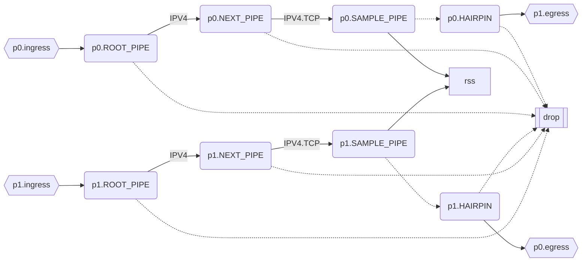
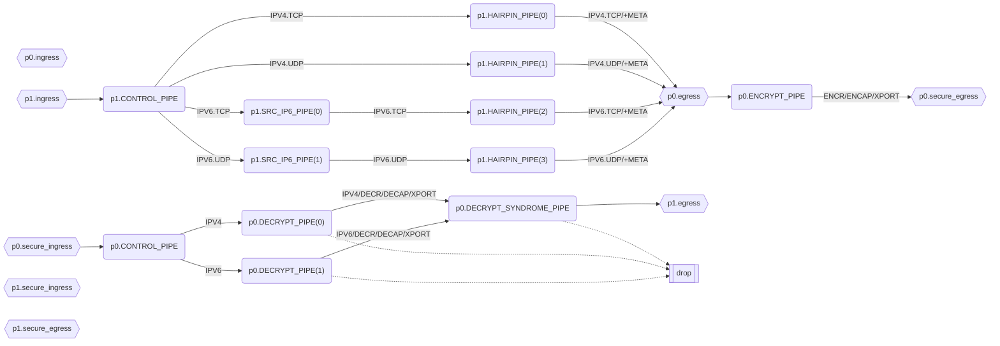
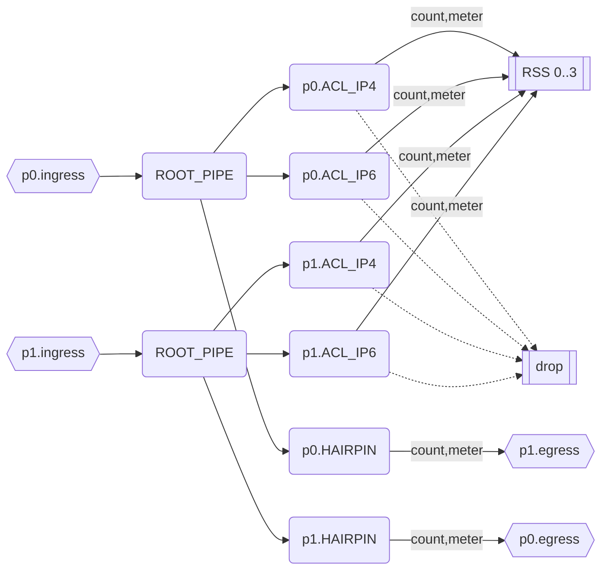

# DOCA Flow Visualizer

The `flow-viz` library is a wrapper for `DOCA Flow`. It intercepts calls to create/destroy Pipes, and builds an internal representation of their forwarding actions to build a logical graph of their connections. This graph is then exported in Mermaid format.

Prerequisites: DOCA 2.0.2

## Building `flow-viz`:
```
meson build
ninja -C build
```

Viewing the results:

During development, it's handy to install a Mermaid [previewer plugin](https://marketplace.visualstudio.com/items?itemName=bierner.markdown-mermaid) for VSCode.

One common method of rendering Mermaid graphs is to include them in Markdown in a Mermaid code block (` ```mermaid ... ``` `); this displays correctly in a Web browser when the Markdown is rendered by [Gitlab](https://docs.gitlab.com/ee/user/markdown.html#mermaid).

Mermaid can also be embedded into HTML as described [here](https://mermaid.js.org/config/usage.html).

## Usage:

Simply prefix your regular DOCA application command line with `LD_PRELOAD=/path/to/libdocaflow-viz.so` and run your DOCA program normally.

## Examples

### Built-in Sample

Running the built-in sample:

(Use the PCI BDF appropriate to your system)
```
LD_PRELOAD=build/lib/libdoca-flow-viz.so build/test/sample_flow_program -a03:00.0,dv_flow_en=2 -a03:00.1,dv_flow_en=2 -c0x1
```

Output:


### IPSec Security Gateway

Running the DOCA IPsec Security GW Sample Application:
```
LD_PRELOAD=build/lib/libdoca-flow-viz.so /opt/mellanox/doca/applications/security_gateway/bin/doca_security_gateway -s 03:00.0 -u 03:00.1 -m transport -c /opt/mellanox/doca/applications/security_gateway/bin/security_gateway_config.json -l 50
```

Actual output!



### Future

Example output of a hypothetical application (work in progress):
